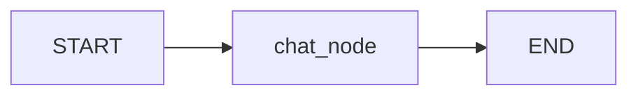
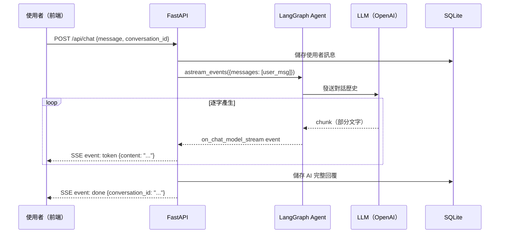

# Case 1: 基礎聊天機器人

## 前置知識

- Python 基礎（async/await、class、type hints）
- React 基礎（useState、useEffect、useRef）
- REST API 基本概念

---

## 本課核心概念

### 什麼是 LangGraph？

LangGraph 將 AI Agent 的邏輯建模為一個**有向圖（Directed Graph）**：



- **節點（Node）**：Agent 的每個處理步驟（如呼叫 LLM）
- **邊（Edge）**：步驟之間的流向
- **狀態（State）**：在節點之間傳遞的共享資料

### 核心 API

| API | 說明 |
|-----|------|
| `StateGraph(AgentState)` | 建立圖，指定狀態結構 |
| `graph.add_node("name", func)` | 新增節點 |
| `graph.add_edge(START, "name")` | 新增邊（固定流向） |
| `graph.compile(checkpointer=...)` | 編譯圖，加上記憶功能 |
| `agent.ainvoke(payload, config)` | 執行一次（完整結果） |
| `agent.astream_events(payload, config)` | 串流執行（逐步結果） |

### AgentState 與 add_messages

```python
class AgentState(TypedDict):
    messages: Annotated[list, add_messages]
```

- `messages` 是一個 list，儲存所有對話訊息
- `add_messages` 是 **reducer**：每次節點回傳 `{"messages": [新訊息]}` 時，新訊息會**追加**到 list，而非覆蓋
- 這是 LangGraph 處理對話歷史的核心機制

### MemorySaver

- `MemorySaver()` 是 **checkpointer**，在記憶體中保存每個 `thread_id` 的完整狀態
- 同一個 `thread_id` 的對話可以延續上下文
- 後續 Case 會學到 `SqliteSaver` 持久化版本

### SSE（Server-Sent Events）

SSE 讓伺服器主動推送資料給瀏覽器，適合 LLM 的逐字輸出：

```
event: token
data: {"content": "你"}

event: token
data: {"content": "好"}

event: done
data: {"conversation_id": "abc-123"}
```

前端使用 `fetch` + `ReadableStream` 解析這些事件。

---

## 實踐內容

### 資料夾結構

```
case1_basic_chatbot/
├── backend/
│   ├── agent.py            ← LangGraph Agent（核心）
│   ├── api.py              ← FastAPI + SSE 端點
│   ├── database.py         ← SQLAlchemy Core 表定義
│   ├── models.py           ← Pydantic 請求/回應模型
│   ├── config.py           ← 環境變數設定
│   ├── seed_data.py        ← 模擬資料產生器
│   └── requirements.txt    ← Python 相依套件
├── frontend/
│   ├── src/
│   │   ├── App.tsx         ← 根元件
│   │   ├── Chat.tsx        ← 主聊天介面
│   │   ├── Chat.css        ← 深藍金色主題樣式
│   │   └── main.tsx        ← React 入口
│   ├── index.html
│   ├── package.json
│   ├── vite.config.ts      ← Vite 設定（含 API 代理）
│   └── tsconfig.json
├── docker-compose.yaml     ← 容器部署
├── Dockerfile.backend
├── Dockerfile.frontend
└── .env.example            ← 環境變數範本
```

### 程式碼流程



---

## 程式碼導讀

### 1. `backend/agent.py` — Agent 核心

這是整個 Case 最重要的檔案，定義了 LangGraph 的圖結構：

- **AgentState**：狀態容器，只有一個 `messages` 欄位
- **ChatAgent 類別**：
  - `__init__`：初始化 LLM（ChatOpenAI）
  - `create_agent()`：建立圖（`StateGraph` → 加節點 → 加邊 → 編譯）
- **chat_node**：唯一的節點，將 messages 送給 LLM 取得回覆

```
圖結構：START → chat_node → END
```

### 2. `backend/api.py` — API 層

- **lifespan**：應用啟動時初始化 DB + 建立 Agent
- **POST /api/chat**：核心端點，接收訊息 → 呼叫 Agent → SSE 串流回覆
  - 使用 `agent.astream_events()` 取得串流事件
  - 過濾 `on_chat_model_stream` 事件取得 LLM 的逐字輸出
  - 串流結束後將完整回覆存入 SQLite
- **GET /api/conversations**：對話列表
- **GET /api/conversations/{id}**：對話詳情
- **DELETE /api/conversations/{id}**：刪除對話

### 3. `backend/database.py` — 資料庫

兩張表：
- `conversations`：對話記錄（id, title, created_at, updated_at）
- `messages`：訊息記錄（id, conversation_id, role, content, created_at）

使用 SQLAlchemy Core 的 `Table` + `MetaData`，不使用 ORM。

### 4. `frontend/src/Chat.tsx` — 前端聊天介面

- **SSE 接收**：使用 `fetch` + `ReadableStream` 解析 SSE 事件
- **狀態管理**：messages、input、loading、conversationId、conversations
- **Sidebar**：對話列表（可收折）
- **Topbar**：標題 + 主題切換
- **Messages**：使用者/助手訊息泡泡 + Markdown 渲染
- **Input**：自動調整高度的 textarea + 送出按鈕

### 5. `frontend/src/Chat.css` — 設計系統

- CSS 變數控制所有顏色（深色/亮色切換）
- 深藍金色主題：`--bg: #050d1a`、`--gold: #c8a96e`
- 動畫：`fadeUp`（進場）、`typingBounce`（打字指示器）、`pulse`（載入）

---

## 執行方式

### 方式一：本地開發

**1. 啟動 Backend**
```bash
cd case1_basic_chatbot/backend

# 建立 .env 檔案（從範本複製並填入 API Key）
cp ../.env.example .env
# 編輯 .env，填入 OPENAI_API_KEY

# 安裝相依套件
pip install -r requirements.txt

# （可選）產生模擬資料
python seed_data.py

# 啟動伺服器
python api.py
# 伺服器會在 http://localhost:8000 啟動
```

**2. 啟動 Frontend**
```bash
cd case1_basic_chatbot/frontend

# 安裝相依套件
npm install

# 啟動開發伺服器
npm run dev
# 前端會在 http://localhost:5173 啟動
# API 請求會自動代理到 http://localhost:8000
```

**3. 開啟瀏覽器**
- 訪問 `http://localhost:5173`
- 輸入訊息開始對話

### 方式二：Docker 部署

```bash
cd case1_basic_chatbot

# 建立 .env 檔案
cp .env.example .env
# 編輯 .env，填入 OPENAI_API_KEY 和 port 設定

# 建立外部網路（只需執行一次）
docker network create aiagent-network

# 啟動容器
docker-compose up -d

# 查看日誌
docker-compose logs -f

# 停止
docker-compose down
```

---

## 測試驗證

### 基本功能測試

1. **對話功能**：輸入「你好」，應收到 AI 串流回覆
2. **對話延續**：繼續輸入訊息，AI 應記得之前的對話內容
3. **Markdown 渲染**：問「請用表格比較 Python 和 JavaScript」，驗證表格渲染
4. **對話列表**：Sidebar 應顯示剛才的對話
5. **載入歷史**：點擊 Sidebar 的對話項目，應載入完整對話
6. **新對話**：點擊「新對話」按鈕，應清空畫面
7. **刪除對話**：hover 對話項目出現刪除按鈕，點擊可刪除
8. **主題切換**：點擊 Topbar 的日/月圖示，切換深色/亮色

### API 直接測試

```bash
# 測試聊天 API（會回傳 SSE 串流）
curl -N -X POST http://localhost:8000/api/chat \
  -H "Content-Type: application/json" \
  -d '{"message": "你好"}'

# 測試對話列表
curl http://localhost:8000/api/conversations
```

---

## 延伸挑戰

完成基本功能後，可以嘗試：

1. **修改 system prompt**：在 `agent.py` 的 `chat_node` 中，在 messages 前面加入 system message，讓 AI 扮演特定角色
2. **調整溫度**：修改 `.env` 中的 `OPENAI_TEMPERATURE`，觀察回覆風格的變化
3. **新增 token 計數**：在 SSE 串流結束時回傳 token 用量
4. **支援 Ollama**：修改 `config.py` 讓 `OPENAI_BASE_URL` 指向 Ollama 的相容端點

---

## 下一步

完成 Case 1 後，你已經掌握了：
- LangGraph 的基本圖結構（StateGraph → Node → Edge → Compile）
- Agent 的非同步執行（ainvoke / astream_events）
- FastAPI + SSE 串流
- React 前端與 SSE 整合

在 **Case 2: ReAct Agent** 中，你將學習如何讓 Agent 使用工具（tools），並透過條件路由實現 ReAct 迴圈。
