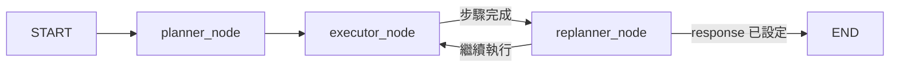

# Case 4 — Plan-Execute Agent 教學文件

## 前置知識

請先完成 Case 1（StateGraph 基礎）、Case 2（ReAct 工具呼叫）、Case 3（工具開發）。

---

## 1. 概念說明

### Plan-Execute 架構

ReAct Agent 每步都讓 LLM 即時決定「下一步做什麼」，適合短流程；但當任務複雜（例如多日旅遊規劃），LLM 很容易在執行過程中「迷路」，忘記整體目標。

**Plan-Execute** 將決策拆分為三個角色：

| 角色 | 節點 | 職責 |
|------|------|------|
| 規劃器 | `planner_node` | 分析需求，產出結構化步驟清單 |
| 執行器 | `executor_node` + `tool_node` | 逐步執行，使用工具收集資料 |
| 重新規劃器 | `replanner_node` | 評估所有步驟是否完成，整合最終答案 |



> **注意**：executor_node 是自包含設計，工具呼叫在節點內部直接執行，不需要獨立的 tool_node。

---

## 2. 核心概念

### 2.1 AgentState 擴展

```python
class AgentState(TypedDict):
    user_request: str              # 使用者的原始需求（不變）
    plan: list[str]                # 步驟清單（由 planner 設定）
    past_steps: Annotated[list[dict], operator.add]  # 已完成步驟（累積）
    response: str                  # 最終回覆（由 replanner 設定）
    messages: Annotated[list, add_messages]           # LLM 對話歷史
    replan_count: int              # 防止無限重新規劃的計數器
```

**關鍵：`operator.add` Reducer**

`Annotated[list[dict], operator.add]` 意味著：每次節點回傳 `{"past_steps": [new_item]}`，LangGraph 會自動把 `new_item` **附加**到現有列表，而不是覆蓋。

```python
# 執行器完成一步後這樣回傳：
return {"past_steps": [{"step": step_text, "result": result}]}
# LangGraph 會把這個 dict 附加到現有的 past_steps 列表
```

### 2.2 `with_structured_output` — 強制 JSON 輸出

```python
class TravelPlan(BaseModel):
    destination: str
    duration_days: int
    steps: list[str]  # 例如 ["搜尋東京景點", "查詢天氣", ...]

planning_llm = base_llm.with_structured_output(TravelPlan)
```

LangGraph 透過 function calling 強制 LLM 輸出符合 schema 的 JSON，完全避免文字解析的不穩定性。

### 2.3 executor_node 自包含設計

`executor_node` 每次呼叫負責完整地完成**一個步驟**，流程全在節點內部完成：

1. 決定目前要執行哪個步驟：`step_idx = len(state["past_steps"])`
2. 呼叫 `executor_llm`（有工具綁定），讓 LLM 決定要用哪些工具
3. 直接在節點內執行所有 tool_calls，收集所有 ToolMessage
4. 把所有工具結果一起交給 `synthesis_llm` 整合成步驟摘要
5. 回傳 `past_steps`（一個步驟的完成記錄），由 reducer 累積

```python
async def executor_node(state: AgentState):
    step_idx = len(state["past_steps"])
    step_text = state["plan"][step_idx]

    # Step 1：呼叫 executor_llm，決定使用哪個工具
    ai_response = await executor_llm.ainvoke([SystemMessage(...), HumanMessage(step_text)])

    if not ai_response.tool_calls:
        return {"messages": [ai_response], "past_steps": [{"step": step_text, "result": ai_response.content}]}

    # Step 2：直接在節點內執行所有工具
    tool_messages = []
    for tc in ai_response.tool_calls:
        output = await tool_map[tc["name"]].ainvoke(tc["args"])
        tool_messages.append(ToolMessage(content=str(output), tool_call_id=tc["id"]))

    # Step 3：synthesis_llm 整合所有工具結果為步驟摘要
    summary = await synthesis_llm.ainvoke([SystemMessage(...), HumanMessage(step_text), ai_response, *tool_messages])

    return {"messages": [...], "past_steps": [{"step": step_text, "result": summary.content}]}
```

這個設計的關鍵優點：每次 `executor_node` 呼叫保證「一進一出」——進入時 `past_steps` 有 N 筆，離開時有 N+1 筆，狀態流轉完全可預測。

### 2.4 replanner_node — 決策樞紐

每次 `executor_node` 完成一步後，`replanner_node` 評估：

```python
async def replanner_node(state: AgentState) -> dict:
    completed = len(state["past_steps"])
    total = len(state["plan"])

    if completed >= total or state["replan_count"] >= 3:
        # 所有步驟完成 → 整合最終回覆
        final = await self.synthesis_llm.ainvoke([...])
        return {"response": final.content}
    else:
        # 還有步驟未完成 → 繼續執行
        return {"replan_count": state["replan_count"] + 1}
```

路由函數根據 `response` 是否有值來決定去向：

```python
def should_end(state: AgentState) -> str:
    return "end" if state.get("response") else "continue"

graph.add_conditional_edges("replanner_node", should_end, {
    "end": END,
    "continue": "executor_node",
})
```

---

## 3. 實踐內容

### 資料夾結構

```
case4_plan_execute/
├── backend/
│   ├── agent.py          # PlanExecuteAgent（核心）
│   ├── api.py            # SSE 串流 API（含 Plan 事件）
│   ├── config.py         # 環境變數設定
│   ├── database.py       # SQLAlchemy Core：conversations, messages
│   ├── models.py         # TravelPlan, ChatRequest 等 Pydantic 模型
│   ├── seed_data.py      # 範例旅行對話資料
│   ├── requirements.txt
│   └── tools/
│       ├── __init__.py
│       ├── attractions.py  # search_attractions（模擬）
│       ├── weather.py      # check_weather（模擬）
│       ├── restaurants.py  # find_restaurants（模擬）
│       └── cost.py         # estimate_cost（費用估算）
├── frontend/
│   ├── src/
│   │   ├── App.tsx
│   │   ├── Chat.tsx          # 主聊天介面（含 Plan SSE 處理）
│   │   ├── Chat.css
│   │   ├── PlanTimeline.tsx  # 步驟視覺化元件
│   │   ├── PlanTimeline.css
│   │   └── main.tsx
│   ├── index.html
│   ├── package.json
│   ├── vite.config.ts
│   └── tsconfig.json
├── docker-compose.yaml
├── Dockerfile.backend
├── Dockerfile.frontend
├── .env.example
└── qa.md
```

---

## 4. 程式碼導讀

### 4.1 `backend/models.py` — TravelPlan

```python
class TravelPlan(BaseModel):
    """planner_node 使用 with_structured_output 強制 LLM 輸出此格式"""
    destination: str
    duration_days: int
    steps: list[str]
```

`steps` 是整個 Plan-Execute 的骨架 — 後續 `executor_node` 逐一執行 `steps` 中的每個字串。

### 4.2 `backend/agent.py` — PlanExecuteAgent

三個 LLM 實例各司其職：

```python
self.planning_llm   = base_llm.with_structured_output(TravelPlan)  # 只規劃
self.executor_llm   = base_llm.bind_tools(ALL_TOOLS)               # 只執行
self.synthesis_llm  = base_llm                                      # 只整合
```

圖的連接方式（簡化版，executor 自包含）：

```
START → planner_node → executor_node → replanner_node
replanner_node ─(response 已設定)→ END
replanner_node ─(未設定)→ executor_node
```

### 4.3 `backend/api.py` — Plan-Execute SSE 事件

新增三種事件，對應前端步驟視覺化：

| 事件 | 觸發條件 | 資料 |
|------|---------|------|
| `plan_created` | `on_chain_end` + `planner_node` | `{"steps": [...]}` |
| `step_start` | `on_chain_start` + `executor_node` | `{"step_index": 0, "step_text": "..."}` |
| `step_done` | `on_chain_end` + `executor_node` | `{"step_index": 0, "result": "..."}` |

Token 只在 `replanner_node` 的最終整合階段串流，避免中間執行步驟的噪音：

```python
elif etype == "on_chat_model_stream":
    node = event.get("metadata", {}).get("langgraph_node", "")
    if node == "replanner_node":  # 只有最終整合才串流
        chunk = event["data"]["chunk"].content
        if chunk:
            yield {"event": "token", "data": json.dumps({"content": chunk})}
```

### 4.4 `frontend/src/PlanTimeline.tsx` — 步驟視覺化

`PlanStep` 型別：

```typescript
interface PlanStep {
  text: string
  status: 'pending' | 'running' | 'done'
  result?: string
}
```

步驟狀態對應的視覺化：
- `pending`：灰色圓點（尚未執行）
- `running`：旋轉動畫（正在執行，藍色）
- `done`：金色勾選圖示 ＋ 結果摘要（2 行截斷）

### 4.5 `frontend/src/Chat.tsx` — SSE 事件處理

```typescript
} else if (eventType === 'plan_created') {
  // 初始化所有步驟為 pending
  const steps = data.steps.map(text => ({ text, status: 'pending' }))
  setMessages(prev => { ... updated[assistantIdx].planSteps = steps ... })

} else if (eventType === 'step_start') {
  // 更新對應步驟為 running
  const newSteps = msg.planSteps.map((s, idx) =>
    idx === step_index ? { ...s, status: 'running' } : s
  )

} else if (eventType === 'step_done') {
  // 更新對應步驟為 done，附加結果摘要
  const newSteps = msg.planSteps.map((s, idx) =>
    idx === step_index ? { ...s, status: 'done', result } : s
  )
}
```

歷史對話載入時，從 `plan_json` 還原步驟（全部顯示為 done）：

```typescript
if (m.plan_json) {
  const planArr = JSON.parse(m.plan_json)
  msg.planSteps = planArr.map(text => ({ text, status: 'done' }))
}
```

---

## 5. 執行方式

### 本地開發

```bash
# 後端
cd case4_plan_execute/backend
pip install -r requirements.txt
python api.py           # 啟動於 localhost:8000

# 前端（另開終端）
cd case4_plan_execute/frontend
npm install
npm run dev             # 啟動於 localhost:5173
```

前端預設開啟後，在左側 Sidebar 填入 API Key 即可使用。

### Docker 部署

```bash
cd case4_plan_execute
cp .env.example .env    # 調整 PORT 等設定
docker-compose up -d
```

確認容器啟動：

```bash
docker-compose logs -f case4-backend
```

---

## 6. 測試驗證

### 基本功能測試

1. 填入 API Key，輸入：「幫我規劃東京 3 天 2 人行程，標準住宿」
2. 觀察 PlanTimeline 出現在訊息中，步驟依序從 pending → running → done
3. 所有步驟完成後，最終旅遊計劃以 Markdown 串流呈現

### 驗證重點

| 項目 | 預期行為 |
|------|---------|
| `plan_created` | Timeline 初始化，4-5 個步驟全為 pending |
| `step_start` | 對應步驟變為 running（旋轉動畫）|
| `step_done` | 步驟變為 done，顯示結果摘要（最多 2 行）|
| `token` | 最終整合文字逐字出現在訊息泡泡中 |
| 歷史對話 | 重新載入時，步驟全部顯示為 done |

### API 手動測試

```bash
curl -X POST http://localhost:8000/api/chat \
  -H "Content-Type: application/json" \
  -d '{
    "message": "大阪 2 天行程",
    "llm_config": {
      "api_key": "sk-...",
      "model": "gpt-4o-mini",
      "base_url": "https://api.openai.com/v1",
      "temperature": 0.7
    }
  }' --no-buffer
```

---

## 7. 延伸挑戰

1. **步驟失敗重新規劃**：當某個工具執行失敗時，讓 `replanner_node` 調整計劃（移除失敗步驟，替換為備用步驟）
2. **動態調整步驟數**：讓使用者在執行中途追加需求，觸發重新規劃
3. **平行步驟執行**：將互不依賴的步驟（例如天氣查詢和景點搜尋）改為並行執行（參考 Case 5 Map-Reduce 模式）
4. **多目的地規劃**：支援「東京 + 大阪」的跨城市行程，為每個城市分別規劃子計劃
